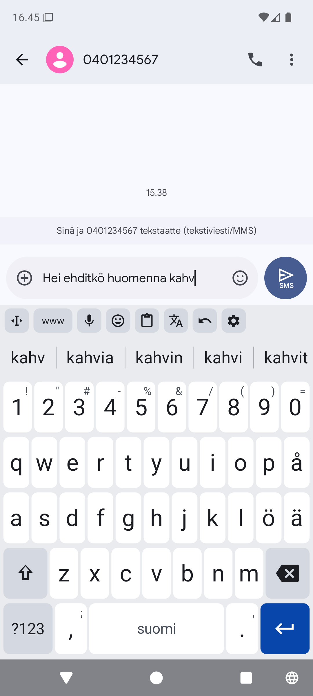
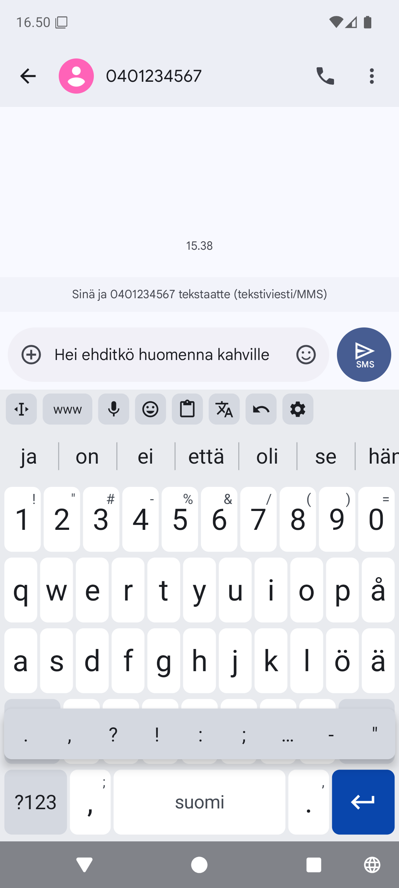
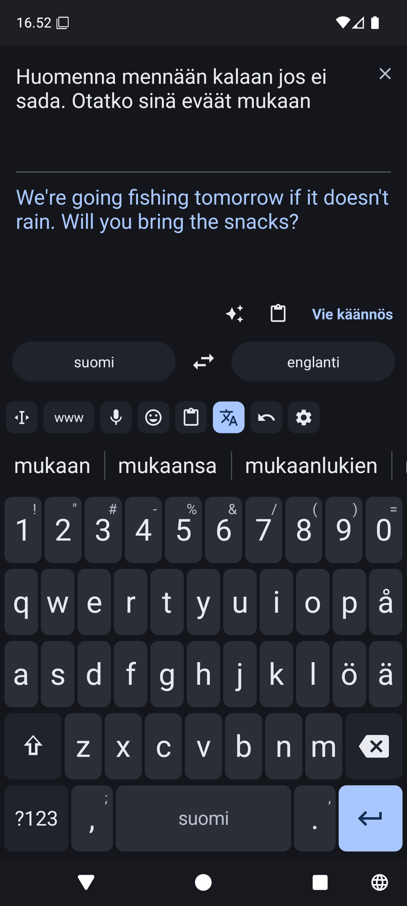
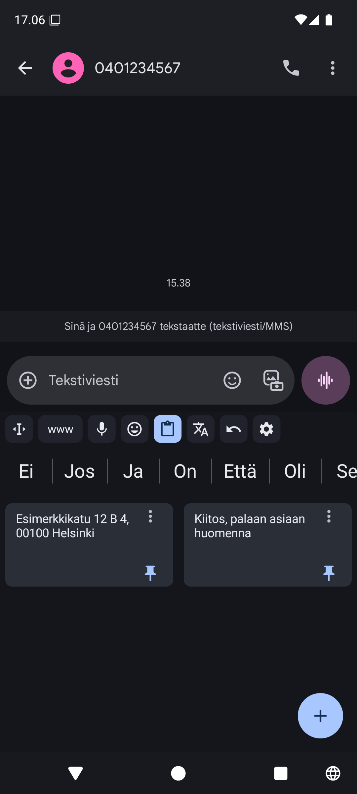

# ARK-näppäimistö

Suomalainen Android-näppäimistö, joka oppii sinun sanasi – kokonaan
laitteella.

  
  
  
  

## Ominaisuudet

- **Oppii sinun sanasi** ja ennustaa seuraavan sanan
- **5–8 ehdotusta** vieritettävällä rivillä
- **Merkkivalikko** pitkällä painalluksella, valinta napauttamalla
- **Käännösnäkymä** laitteella sekä valinnainen ✨ AI-käännös
- **Sanelu** laitteen tai OpenAI:n puheentunnistuksella
- **Leikepöytä** kiinnitettävine leikkeineen
- **Emojit**, kursoritila ja muokattava työkalurivi
- **Salasanojen täyttö** suoraan ehdotusriviltä
- **Yksityinen:** ei analytiikkaa eikä mainoksia, oppiminen pysyy laitteella

## Lataus ja ohjeet

Lataa uusin APK [Releases-sivulta](https://github.com/jrs8205/ARK-nappaimisto/releases/latest).
Asennus, AI-käännöksen ja sanelun API-avaimet sekä yksityisyys:
**[Ohjeet](docs/ohjeet.md)**.

## Lisenssi

[GPL-3.0](LICENSE). Sanalista: Kotimaisten kielten keskus
([CC BY 4.0](https://creativecommons.org/licenses/by/4.0/deed.fi)), ks.
[docs/sanalista.md](docs/sanalista.md).
